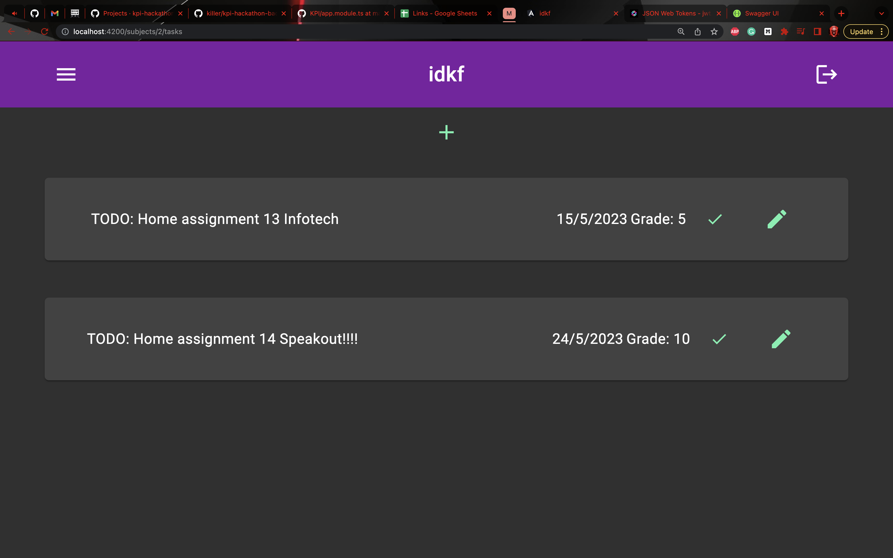

# kpi-hackathon-front

Hackathon is over, we are 2nd place. Congratulations to 1st place! your design was better, but have the code meat. In this repo i'll explain all the technical stuff and how our project works.

- [kpi-hackathon-front](#kpi-hackathon-front)
  - [Usage explanation](#usage-explanation)
    - [Authentication](#authentication)
      - [Login page](#login-page)
      - [Create account](#create-account)
      - [Verification email and mfa email](#verification-email-and-mfa-email)
      - [Adding authenticator](#adding-authenticator)
      - [Resetting password](#resetting-password)
      - [Loggining in](#loggining-in)
    - [Site](#site)
      - [Subjects page](#subjects-page)
      - [Adaptive menu](#adaptive-menu)
      - [Tasks of subject](#tasks-of-subject)
      - [All tasks](#all-tasks)
      - [Create task](#create-task)
    - [Back end of front end?](#back-end-of-front-end)
      - [Components](#components)
      - [Redux](#redux)
        - [Actions](#actions)
        - [State](#state)
  - [Closing remarks](#closing-remarks)
  - [Пояснення технологій](#пояснення-технологій)
    - [Single page application](#single-page-application)
    - [Nx](#nx)
    - [Я не знаю стилів](#я-не-знаю-стилів)
    - [Redux](#redux-1)
    - [Container/Presentation Components](#containerpresentation-components)
    - [Додатково](#додатково)
  - [Умова](#умова)
    - [Функціональні вимоги на прикладі Web-напряму](#функціональні-вимоги-на-прикладі-web-напряму)
      - [Реєстрація та вхід](#реєстрація-та-вхід)
      - [Інформаційна панель (Dashboard)](#інформаційна-панель-dashboard)
      - [Створення предметів](#створення-предметів)
      - [Створення завдань](#створення-завдань)
      - [Редагування завдань](#редагування-завдань)
      - [Видалення завдань](#видалення-завдань)
    - [Додаткові фічі](#додаткові-фічі)

## Usage explanation

### Authentication

#### Login page

When user first enters the site, they are sent to login or create their accout with the login page.

Users may use the Google account to continue, or create our accout with email and password

#### Create account

#### Verification email and mfa email

After creating their accout, users will reseive convirmation email and link to set up their multifactor authentification.

Users may setup their authenticator app with provided link, they will see following page

#### Adding authenticator

Where they will need to scan qr code with their authenticator app. It may be Google authenticator, or Authenticator from Microsoft. After scanning our project will be in their authenticator app.

They will need to enter this code in page to finish the setup

#### Resetting password

If user has verified their email, and forgot their passord, they can change it with proper button.

Email with one time link will be sent to change password

And they will have to set a new one.

#### Loggining in

Now for the logging in. After entering email and password or using identity provider, the user will be asked to enter their authenticator one time code

If user can't access their Authenticator app, they may choose email code instead

Or they could've entered authenticator code

### Site

#### Subjects page

After all these authentication features we can finally get to our app as securily as possible. When we enter it, we will see all subjects user has previously created

#### Adaptive menu

Here we can navigate to either all tasks or back here with menu on the left, which is responsive

#### Tasks of subject

If we click on any subject, we will go to it's tasks. For example these are tasks for Electonics. We can change status of these tasks with dropdown menu.

If the task is not yet complete, and deadline is in 2 or less days, it will glow red

But if we finish it...

#### All tasks

We can also see all tasks based on their deadlines in task view(in menu from sidebar)

Let's create a task! You already saw that + symbol on top, let's click on it

#### Create task

Here we will need to enter it's name, optionally descriptoiin to it, number of points we can get for it, and we will need to select deadline and Subject it's related to. To make things easier for users to select deadline a cute calendar is used

And to help users select the subject, we have a simple search menu, which will show all tasks and as you type it will filter it out

Because i restructured the screenshots, you could already see this task in all tasks view. But we can also see it in subject view

### Back end of front end?

#### Components

This was about how it looks to users, but this is how it looks to me.

Presentation component with styles, which are used in container components, which provide data. And now let's check the redux state. THis part is cool.

#### Redux

##### Actions

You can see actions here, which were deployed after reloading tasks view, we load tasks and check if user is authenticated, after we sent load tasks, the spa does request to api for tasks, after this router finishes navigation and we are waiting for response, while it was out, our state reseived user auth details from authService and added it to our state, after it api responded, and our effect dispatched another action, which added tasks to state, making them available throug selectors and our component gladly took them. Let's see the state itself

##### State

There are 4 parts of it. Stuff related to router and navigation, user details and token so we can easily see it. it is added in other place, but it's here just so we can test it. And we can see tasks with subjects. Let's check auth state

This can be used in ui, but we didn't have time for that. This is router state

Here we can find route params, our url, and all the stuff you would need when working with route in angular all. Next up is our subjects state

Because we reloaded, it's empty, our app doesn't need subjects to show you tasks, so it's not here. This is pretty basic but can save some network time. Finally we have tasks, this one is not empty

There is a lot of them here, and they are all being isplayed.

## Closing remarks

And i think it's all the stuff I can show. You can go check other repository for backend stuff boiz did. It was a pleasure working with them and we had so much fun, even though we had 30 min to talk with each other b4 jumping straight to the coding. This is their swagger page

I won't be taking fun from them, so go check other repo.

## Пояснення технологій

Як головний бебрик на фронті зараз розпишу що саме ми використовуємо.

### Single page application

По-перше в нас SPA(`Single Page Application`), бо прості сайти для простих людей, ми кпішніки нам таке не підходить. Для створення спа використовуємо популярний та могучий фреймворк Angular.

### Nx

В великих компаніях зазвичай використовують певні утиліти для керування кодом, бо кода багато, проект великий, сторінок багато, а програмісти ліниві, тому така утиліта як `Nx` дозволяє керувати версіями прокету, різними підпроектами та таким інше, що спрощує написання. В нас звісно замаленький сайтик, але генерація коду сильно спрощує рутинні завдання

### Я не знаю стилів

Оскільки я взагалі бек енд і мене відправили на фронт, в мене не так багато дизайнерського досвіду, можливо мій помічник щось вміє(він буде стилі робити) тому я покладаюсь на нього, але в нього є `Angular Material` який по суті може за нас зробити красу, нам потрібно тільки все налаштувати.

### Redux

А ось це вже моє улюблене - паттерн `Redux`! Це просто монстр а не патерн, який дозволяє зберігати стан сайту в одному місці та керувати всім з одного місця. Він дозволяє спростити використання API, бо значення будуть зберігатись до перезавантаження на сторінці, а не постійно перезавантажуватись при кожному тиці.

### Container/Presentation Components

Ще один принцим - розбити всі компоненти на контейнер та презентейшн. Контейнер компоненти взаємодіють зі `store` та отримують данні, які далі передають презентейшн компонентам, які ці данні відображають. Так в нас стилі відокремлені від логіки доступу до данних, а складні перетворення відокремлені від компонентів в `store`. Також ми плануємо перевикористовувати презентейшн компоненти в різних контейнер компонентах, але надаючи різні данні

### Додатково

Я б ще трохи розповів, але це вже більше до моєї команди за лінією фронту(бек енд корочі). Там буде crud, Auth0, бази данних та таке інше.

## Умова

- Мета цього проекту - надати студентам університету інструмент для легкого управління своїми завданнями та оцінками. Цей додаток дозволить студентам створювати обліковий запис, предмети та завдання, а також відстежувати свій прогрес протягом семестру. Додаток націлений на розробників будь-якого напряму - Web, Mobile, Telegram Bots тощо - , що дозволить їм продемонструвати свої навички, створюючи функціональний і корисний інструмент для користувачів.

### Функціональні вимоги на прикладі Web-напряму

#### Реєстрація та вхід

Користувачі повинні мати можливість створити новий обліковий запис, вказавши свій нікнейм, електронну адресу та пароль. Після створення облікового запису вони повинні мати можливість увійти в додаток, вказавши свою електронну пошту та пароль.

#### Інформаційна панель (Dashboard)

Після входу в систему користувачі повинні потрапляти на свою інформаційну панель, яка відображатиме список поточних предметів. Панель повинна дозволяти користувачам сортувати предмети за різними критеріями, наприклад, за назвою або загальною кількістю балів.

#### Створення предметів

Користувачі повинні мати можливість створювати нові предмети, натиснувши на кнопку "Новий предмет" на своїй інформаційній панелі. Вони повинні мати можливість вказати назву теми, опис та загальну кількість можливих балів.

#### Створення завдань

Користувачі повинні мати можливість створювати нові завдання, натиснувши на кнопку "Нове завдання" на своїй інформаційній панелі. Вони повинні мати можливість вказати назву завдання, кількість балів і термін виконання. Користувачі також повинні мати можливість призначити завдання до певного предмету. Або створити завдання одразу у “предметі” без додатково призначення.

#### Редагування завдань

Користувачі повинні мати можливість редагувати існуючі завдання, натиснувши на назву завдання на своїй інформаційній панелі. Вони повинні мати можливість змінювати назву завдання, бали, термін виконання і тему. Користувачі також повинні мати можливість позначити завдання як виконане, в процесі виконання або заплановане.

#### Видалення завдань

Користувачі повинні мати можливість видаляти завдання, вибравши його на своїй інформаційній панелі і натиснувши на кнопку "Видалити". Має з'явитися повідомлення з підтвердженням, щоб переконатися, що користувач дійсно хоче видалити завдання.

### Додаткові фічі

Також ви можете вигадати додаткові фічі для своєї системи чи просто зробити її мега зручною і привабливою. Наприклад, можна додати:

1. Анімації горіння дедлайнів
2. Фільтрація та пошук завдань: Користувачі повинні мати можливість шукати завдання, вводячи ключові слова в пошуковий рядок, фільтрувати свої завдання за різними критеріями, такими як тема, термін виконання або статус. Механізм повинен бути простим у використанні і надавати миттєвий зворотній зв'язок користувачеві.
3. Цікаві варіанти представлення завдань для зручності моніторингу
4. Безпека: додаток може використовувати шифрування для захисту даних користувача, таких як паролі та адреси електронної пошти. Додаток також може використовувати найкращі практики аутентифікації та авторизації, щоб гарантувати, що тільки авторизовані користувачі можуть отримати доступ до своїх завдань і змінювати їх.
5. Продуктивність: додаток повинен бути швидким, навіть при роботі з великою кількістю завдань. Додаток повинен бути розроблений таким чином, щоб мінімізувати обсяг даних, що передаються між клієнтом і сервером, і кешувати часто використовувані дані на стороні клієнта.
6. Щось ще :)
